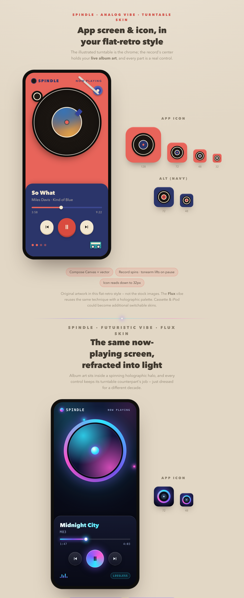

# Spindle

**Turn whatever you're playing into a spinning record you can control** — a vibe-switching
music widget for Android that reads your phone's *live* media session and renders it as a
vintage vinyl deck or a futuristic player. Your choice of skin; no account, no login, no keys.




## What it is

Spindle shows the track currently playing on your phone — Spotify, YouTube Music, podcasts,
**anything** that publishes media controls — as a stylized player with the real album art,
progress, and working transport controls. Pick a **skin** to set the vibe; the app remembers it.

- **No login, no API keys, no account.** Spindle reads Android's system media session, not any
  streaming service's API.
- **Works with free *and* paid** accounts of any supported player.
- **One-time setup:** grant Notification access — the same permission a smartwatch uses to
  control media. That's it.

## Skins

- **Analog (Turntable)** — a flat-retro vinyl deck: the record spins, your album art sits on the
  label, the tonearm lifts when you pause.
- **Flux** — the same now-playing screen refracted into light: album art inside a spinning
  holographic halo, neon glass controls.

Switch anytime from the **⋮** menu. More skins are on the roadmap (see
[`design/skin-ideas.md`](design/skin-ideas.md) — a catalog of 36).

## Home-screen widget

A widget mirrors the now-playing track with album art, a spinning accent ring, and
prev / play-pause / next controls, kept live while music plays.

## How it works

Android exposes the active media session through `NotificationListenerService` +
`MediaSessionManager`. Spindle finds the current `MediaController`, reads its metadata and
playback state, and issues transport commands — no streaming SDK, no OAuth. The in-app player
draws the spinning disc with Jetpack Compose `Canvas`; the widget uses `RemoteViews` (its ring
spins via an indeterminate progress drawable, the one animation widgets allow).

> **Android only.** iOS provides no public API for a third-party app to read or control another
> app's media session, so this concept can't exist there.

## Build & run

Requires Android Studio (or the Android SDK) and a device/emulator running **Android 8.0+**.

```bash
git clone git@github.com:Priyans-hu/spindle.git
cd spindle
./gradlew :app:assembleDebug
# or open the project in Android Studio and Run
```

On first launch, tap **Grant access** and enable Spindle under **Notification access**. Then
play something in any music app and open Spindle. To control real playback you need a music app
installed and playing on the same device.

## Tech

Kotlin · Jetpack Compose · Material 3 · DataStore · `MediaSessionManager` / `MediaController` ·
Jetpack `RemoteViews` widget.

## Roadmap

- More skins from the catalog (CD/Discman, cassette, iPod click-wheel, Winamp)
- Interactive seek (drag to scrub)
- Per-skin theming for the home-screen widget

## License

[MIT](LICENSE) © 2026 Priyanshu Garg.

Spindle is an independent project and is not affiliated with or endorsed by Spotify or any other
music service; it uses Android's public media APIs only.
